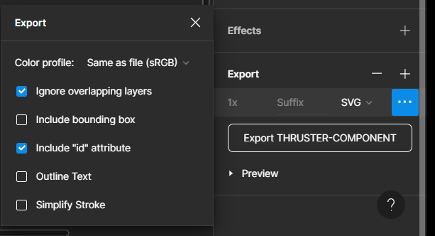

# Crow's Nest - Frontend

A React web-application working as Crow's Nest frontend.

## Development in VSCode

1. Clone the `crowsnest-frontend` repository.
2. Open the `crowsnest-frontend` directory in VSCode.
3. Install the dependencies with:
   `npm install`
4. Open a terminal window and start the frontend development server:
   `npm start` (accessible at `localhost:3000`).
5. Start the crowsnest-gis and crowsnest-tiles services:
   `docker-compose -f docker-compose.dev.yml up -d`

## Production

The Crow's Nest frontend is meant to be served by a docker container. The latest Docker container image can be pulled from [MORISE's public docker registry](https://github.com/orgs/MO-RISE/packages).

To build the image yourself:

1. Clone the `crowsnest-frontend` repository.

   - with HTTPS:
     `git clone https://github.com/MO-RISE/crowsnest-frontend.git`
   - with SSH:
     `git clone git@github.com:MO-RISE/crowsnest-frontend.git`

2. Cd into the main directory (i.e. where the `Dockerfile` file is) and run the following command:

```
docker build . -t crowsnest-frontend .
```

Afterwards, the production container can be run with a command similar to this one:

```
docker run --rm -p 8888:80 crowsnest-frontend
```

The application will then be available at the URL `http://localhost:9999`. Note that the production container exposes its webserver on port 80, so the `-p` flag must be used to bind this port to the host. Furthermore, the `-e` flag can be used to pass the environmental variable `MQTT_BROKER_URL`. This variable points to the URL where the web application can reach an MQTT broker. If `MQTT_BROKER_URL` is not given, the default value of `XXXX` is used.

## Protobuffer

Install comandline tool on locally:

```
npm install -g protobufjs
npm install -g protobufjs-cli
```

Bundel all `.proto`

```
pbjs -t json file1.proto file2.proto > bundle.json


pbjs -t json .\awesome.proto .\CompressedVideo.proto .\envelope.proto .\primitives.proto .\CompressedImage.proto .\RawImage.proto > bundle.json
```

## Transforming SVG to components (Tips and Trix)

Example of export options in figma


1. Transform svg file to react component, this can be done with [svg2jsx](https://svg2jsx.com). Make sure component ID are incudes in the export as svg2jsx has default setting to remove ID.
2. Manual edit svg:
   1. Each props should be defined in function declaration
   2. Text elements should have --> `fontFamily="Roboto"  textAnchor="middle"`
   3.

## Issues

Plotting maps does not work in _Firefox_ because it is not compatible with `OffscreenCanvas`.

## Connectors frontend

- Keelson (Zenoh) -->
  - Input (json): data (str) --> JSON (obj)
  - Input (proto): data (str) --> JSON (obj) - [key, value] -> Vale -> Base64ToBytes --> Envelope --> payload_type
- MQTT -->
  - Input (json): data (str) --> JSON (obj)
  - Input (proto): data (str) --> JSON (obj) --> Base64ToBytes --> Envelope --> payload_type

OUT: KEY & VALUE --> parsed to recoil state

rise/crowsnest/gui/<user_name>/<tag>/<react_component>

rise/crowsnest/<internal_app_name>/<user_name>/<tag>/<react_component>

[
{
"key": "rise/masslab/haddock/masslab-5/lever_position_pct/arduino/left/azimuth/horizontal",
},
{
"key": "rise/masslab/haddock/masslab-5/raw_bytes/arduino/left",
"value": "CgwIgKHuqQYQjIv5kgESGAoMCICh7qkGEPa85ZIBEggCAwAAZAAAAA==",
},
{
"key": "rise/masslab/haddock/masslab-5/lever_position_pct/arduino/left/knob/right",
"value": "CgwIgKHuqQYQqP/mkwESDgoMCICh7qkGEPa85ZIB",
},
{
"key": "rise/masslab/haddock/masslab-5/raw_bytes/arduino/right",
"value": "CgwIgKHuqQYQhrbSlwESHAoMCICh7qkGEKK9vpcBEgwDBQIAGABhAGMAIwA=",
},
{
"key": "rise/masslab/haddock/masslab-5/lever_position_pct/arduino/right/azimuth/horizontal",
"value": "CgwIgKHuqQYQhIX9iAESEwoMCICh7qkGEIKovIgBFQAAAEA=",
},
{
"key": "rise/masslab/haddock/masslab-5/lever_position_pct/arduino/right/azimuth/vertical",
"value": "CgwIgKHuqQYQltWaiQESEwoMCICh7qkGEIKovIgBFQAAwEE=",
},
{
"key": "rise/masslab/haddock/masslab-5/lever_position_pct/arduino/right/knob/left",
"value": "CgwIgKHuqQYQ+snTiQESEwoMCICh7qkGEIKovIgBFQAAxkI=",
},
{
"key": "rise/masslab/haddock/masslab-5/lever_position_pct/arduino/left/azimuth/vertical",
"value": "CgwIgKHuqQYQ5uPMkwESEwoMCICh7qkGEPa85ZIBFQAAyEI=",
},
{
"key": "rise/masslab/haddock/masslab-5/lever_position_pct/arduino/right/knob/right",
"value": "CgwIgKHuqQYQ5+C4iQESEwoMCICh7qkGEIKovIgBFQAAwkI=",
}
]

https://github.com/react-grid-layout/react-draggable

## Example .env development setup

If running development following setup allows for quick configurations to each station

```
REACT_APP_MQTT_USERNAME=""
REACT_APP_MQTT_PASSWORD=""
REACT_APP_MQTT_BROKER_ADDRESS="wss://crowsnest.mo.ri.se:443/mqtt"
REACT_APP_WEBRTC_USERNAME=""
REACT_APP_WEBRTC_PASSWORD=""
REACT_APP_MQTT_LOCAL_BROKER_ADDRESS="localhost"
REACT_APP_MQTT_LOCAL_USERNAME=""
REACT_APP_MQTT_LOCAL_PASSWORD=""
REACT_APP_ZENOH_LOCAL_ROUTER_URL_="http://localhost:8000"
```
